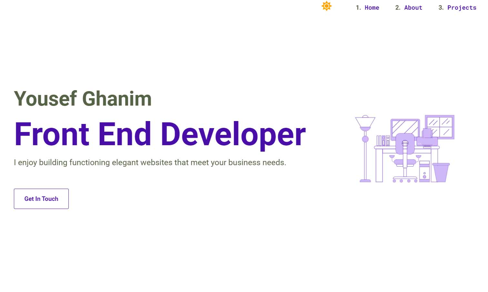

# My Portfolio Website

This is my portfolio website which I created from scratch using `create-react-app`. [Click here](https://yghanim.com/) for preview.



> ## Technologies Used:

- ReactJs.
- CSS.  
  recommend using Styled Components instead. Check my other projects for reference.
- Html.
- Local Storage.

> ## Unique Elements:

- High performance and SEO.
- Clean and elegant design.
- Switching tabs for the “About” section, and filtering buttons for the “Projects” section.
- Bright & dark modes.
- Animated SVGs.

> ## Installation and Setup Instructions:

Clone down this repository. You will need node and npm installed globally on your machine.

### Installation:

```
npm install
```

### To Run Test Suite:

```
npm test
```

### To Start Server:

```
npm start
```

### To Visit App:

```
localhost:3000
```

> ## Reflection:

This was a 3-week long project. Starting from the day I draw on paper to the day I deployed the project to the internet with a specific domain name.

The goal was to build a personal website (portfolio website) to showcase my projects. And to be a clear example to show my ability to build functioning websites from scratch using `create-react-app`.

This project was an excellent chance to learn new things, by implement many things I have learned from projects tutorials. Such as switching tabs that I used in the “About” Section, Filtering buttons in the “Projects” Section, SVG, and Local Storage.

One of the many challenges I have faced in this project is to deploy the website to the internet, as I had used only free services to deploy my previous projects such as Github Pages and Netlify. So, it was a good experience to learn about host, domain, Cpanel, SSL, and many more.
